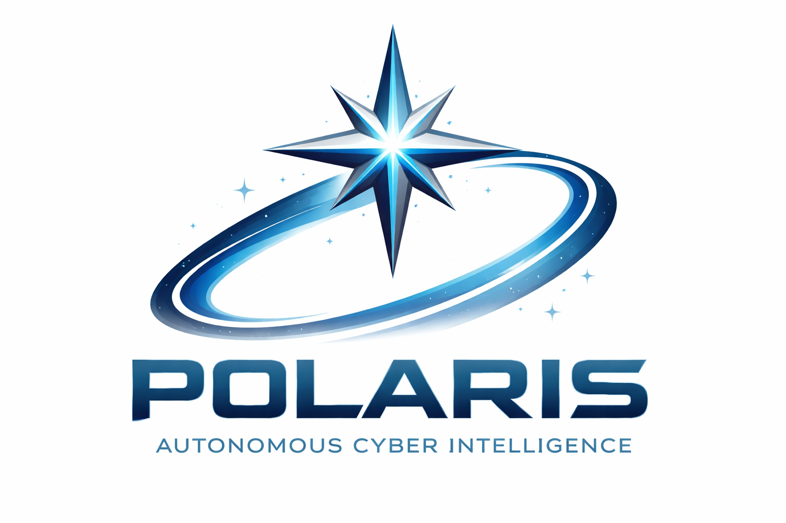
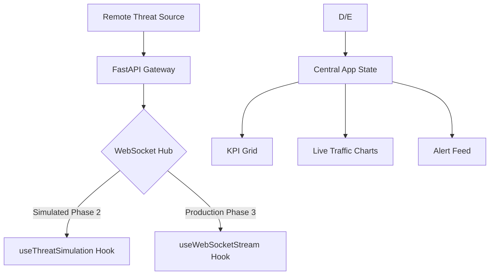

<div align="center">
  
  <h1>POLARIS</h1>
  <h3>Autonomous Cyber Intelligence Orchestration</h3>
  <p><i>Lead Architect & Engineer: <b>Eng. Abdessamad Bourkibate</b></i></p>

  []()
  []()
  []()
</div>

---

## 🏛 Academic Abstract

**POLARIS** is an advanced, high-fidelity cyber intelligence orchestration platform engineered to bridge the gap between Big Data ingestion and actionable security analytics. Moving beyond traditional SIEM capabilities, Polaris implements a **Deep Space Glassmorphism** interface powered by a modular React/TypeScript architecture. It utilizes a multi-layered data verification strategy, including **IsolationForest-style anomaly scoring** and real-time **WebSocket synchronization**, to provide security engineers with a zero-latency view of their threat landscape.

This project serves as a paradigm for modern industrial security infrastructure, emphasizing scalability, precision, and deterministic state management.

---

## 💎 Technical Differentiation

Polaris is distinguished by its radical approach to performance and visual clarity.

| Feature | Polaris (Next-Gen) | Traditional Solutions |
| :--- | :--- | :--- |
| **Data Ingestion** | Low-latency binary streams (FastAPI) | Polling-based batching |
| **Architecture** | Atomic Design / React 19 Hooks | Monolithic legacy frameworks |
| **Logic** | Real-time AI anomaly weighting | Static rule-based thresholding |
| **UI/UX** | GPU-accelerated Glassmorphism | Flat, non-interactive dashboards |
| **Safety** | Strict TypeScript (0 `any` types) | Dynamically typed / Error-prone |

---

## 🛠 Engineering Stack

### **Frontend Orchestration**
- **Framework**: [React 19](https://reactjs.org/) (Strict Mode)
- **Primary Language**: [TypeScript](https://www.typescriptlang.org/) (Enterprise Config)
- **Visual Synthesis**: [Tailwind CSS](https://tailwindcss.com/) with Custom Deep Space Theme
- **Data Visualization**: [Recharts](https://recharts.org/) (Optimized Sliding Windows)
- **Interface Icons**: [Lucide React](https://lucide.dev/) (Vector Precision)

### **Backend Core**
- **Language**: Python 3.12+
- **API Engine**: [FastAPI](https://fastapi.tiangolo.com/) (Asynchronous Execution)
- **Real-time Comms**: WebSockets / [Kafka](https://kafka.apache.org/) Integration
- **Persistance**: SQLite (Development) / PostgreSQL (Production)

---

## 🚀 Deployment & Operational Phases

### 1. Environment Preparation
Ensure you have the following installed on your engineering workstation:
- **Node.js**: v20.x or higher
- **Python**: v3.12+
- **Docker**: (For microservices orchestration)

### 2. Implementation Steps

| Step | Command | Description |
| :--- | :--- | :--- |
| **Initialize Frontend** | `cd frontend && npm install` | Resolve project dependencies |
| **Start Dev Engine** | `npm run dev` | Launch Vite-based HMR server |
| **Build Assets** | `npm run build` | Generate production-ready artifacts |
| **Backend Setup** | `pip install -r requirements.txt`| Configure Python runtime |

### 3. Verification Metrics
To ensure system integrity, execute the following validation suite:
```bash
# Verify Typing Consistency
npm run lint

# Validate Production Build
npm run build
```

---

## 🧠 System Architecture



---

## 🧑‍💻 The Architect

**Eng. Abdessamad Bourkibate**  
*Full-Stack Cyber Security Engineer & Software Architect*

Lead Developer behind the Polaris project, Eng. Bourkibate specializes in crafting high-performance, secure, and visually stunning digital infrastructures. His philosophy centers on the intersection of **Robust Engineering** and **Intuitive Design**.

- 💼 **Focus**: Cyber Intelligence, React/TypeScript Architecture, Backend Optimization.
- 🚀 **Commitment**: Continuous Innovation in Digital Defense Systems.

### **Professional Portfolios & Research**
<div align="left">
  <a href="https://www.linkedin.com/in/abdessamad-bourkibate-b17717350/"></a>
  <a href="https://huggingface.co/abdessamad-bourkibate"></a>
  <a href="https://www.researchgate.net/profile/Abdessamad-Bourkibate-2"></a>
  <a href="https://www.kaggle.com/abdessamadbourkibate"></a>
  <a href="https://leetcode.com/u/bourkibate-abdessamad/"></a>
  <a href="https://tryhackme.com/p/bourkibate.abdessamad"></a>
</div>

---

<p align="center">
  <i>Generated by the POLARIS Intelligence Engine | 2026</i>
</p>
